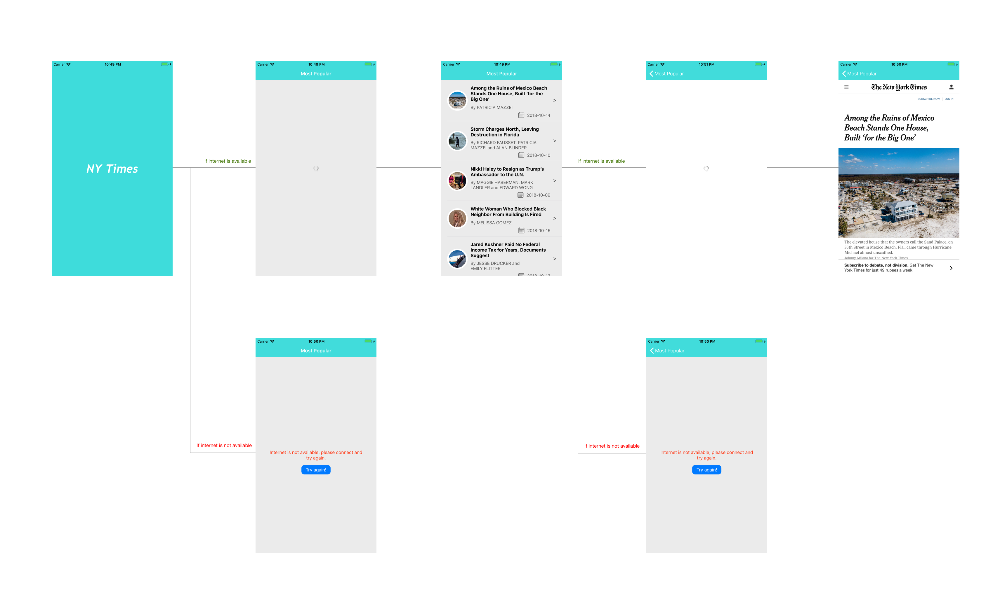

## Build and run the code:
I have not included any libraries from Cocoapods or Carthage hence building and running of the code is straight forward. Please open the project in xCode and click run that you will see at top right corner in your xCode.

Here is the tool and language version used to create the APP:
xCode 9.4.1
Swift 4

## Project Architecture:
To develop this project I have followed MVVM - C architecture, here C is configurator where I created all the dependencies and injected them in concerned places. Here I have followed Protocol Oriented Programming concept introduced by Apple which is very efficient, therefore for every View, ViewModel, API etc I have created Protocols so that I could create mock objects for any class by implementing them which are helpful to write unit test cases.

## Unit Test and Code Coverage:
Due to time constraint I have written test cases only for below modules:
1. Network class “APIClient” which is responsible to handle all the network calls. By creating mock object of URLSession I have covered following cases:
1. Is this class getting success response if API returns correct data.
2. Is this class getting error response if API returns any network error.
3. Is this class getting parsing error in case API returns incorrect data.

2. ArticleListModelView, this class is responsible to handle all the business logic of calling api to fetch articles and instruct view to display them. By creating mock objects of View and API I have covered following cases:
1. Is View refresh list method being called after getting successful response from API.
2. Is View show error method being called after getting failure response from API.

## WireFrame:
Below you can see the complete wireframe of this APP:

